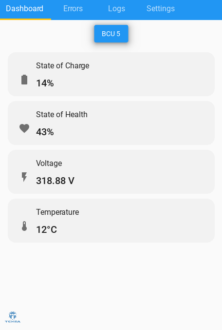
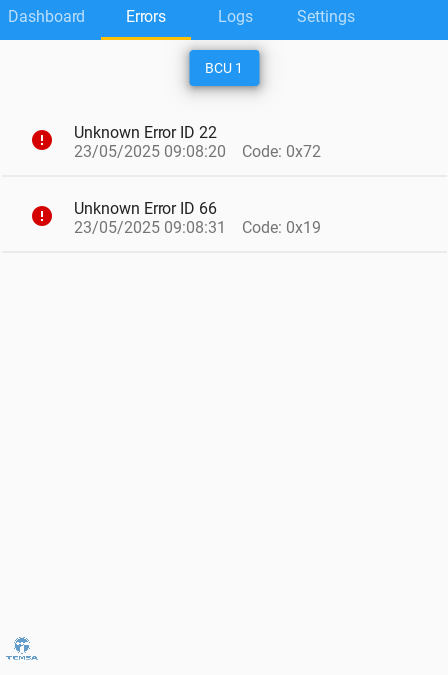
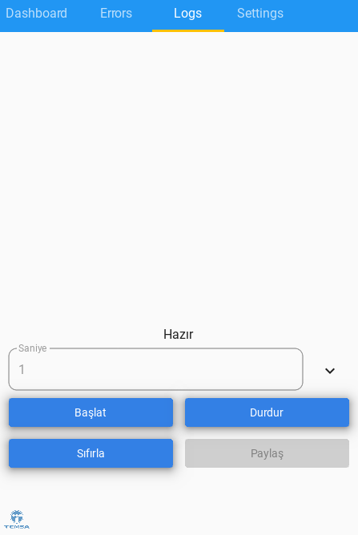

# CAN2Go Mobile – BLE-Based Telemetry & Diagnostics Platform

<p align="center">
  
</p>

**A Bluetooth LE-powered, real-time vehicle telemetry and diagnostics mobile app**  
**Developed at Temsa Skoda Transportation during my Software Engineering Internship**

---

## 🚀 Project Overview

**CAN2Go Mobile** is a mobile application designed for real-time data monitoring, error logging, and diagnostics of vehicle battery systems, utilizing Bluetooth Low Energy (BLE) for wireless communication with ESP32-based embedded hardware.  
The app features a modern Material Design UI (KivyMD) and enables users to scan, connect, visualize, and log CAN-based battery system data directly from mobile devices.

---

## 🏢 Internship Context

This project was developed as part of my **Software Engineering Internship at Temsa Skoda**, where I focused on the intersection of embedded systems, IoT, and mobile development in the automotive industry.  
While this is the **first usable prototype**, the project is designed to be modular, extensible, and ready for further development in production environments.

---

## 📂 Repository Structure

- [`main.py`](./main.py) – App entrypoint and main architecture  
- [`bluetooth_manager.py`](./bluetooth_manager.py) – BLE connection and event handling  
- [`parser.py`](./parser.py) – Raw data parsing (metrics & errors)  
- [`simulator.py`](./simulator.py) – BLE data simulation for development/demo  
- [`dashboard.py`](./dashboard.py) – Dashboard screen: real-time metrics visualization  
- [`errors.py`](./errors.py) – Error screen: BCU error logs  
- [`logs.py`](./logs.py) – Data logging, saving, sharing  
- [`login.py`](./login.py) – Authentication interface  
- [`settings.py`](./settings.py) – BLE device scan & selection  
- [`bluetooth_settings.py`](./bluetooth_settings.py) – (Dialog-based) BLE device selection  
- [`ble.ino`](./ble.ino) – ESP32 Arduino firmware: BLE server for vehicle-side

> All code is modular and thoroughly commented for clarity and extensibility.

---

## 📱 Key Features

- **Bluetooth LE Communication:** Seamless pairing and data exchange with ESP32-based embedded devices
- **Real-Time Dashboard:** Live visualization of State-of-Charge (SOC), State-of-Health (SOH), voltage, and temperature across multiple BCUs
- **Error Logging:** Instant display and logging of battery/controller errors
- **Data Logging:** One-tap data recording, export (BLF), and sharing
- **Device Discovery:** Quick BLE scanning, device selection, and secure connection
- **User Authentication:** Simple login (demo purposes)
- **Cross-Platform UI:** KivyMD-based Material Design, ready for Android deployment

---

## 🛠️ Technologies & Stack

- **Python 3.10+**  
- **Kivy** & **KivyMD** (Material Design for Python)  
- **Bleak** (cross-platform BLE client)  
- **ESP32 (Arduino/C++)** BLE server  
- **Plyer** (optional, for Android sharing)
- **Multithreading & AsyncIO** for real-time operations

---

## 🔗 Quick Code Navigation

| Module / Feature           | File                                               |
|----------------------------|----------------------------------------------------|
| App Architecture           | [main.py](./main.py)                               |
| BLE Communication          | [bluetooth_manager.py](./bluetooth_manager.py)     |
| Data Parsing               | [parser.py](./parser.py)                           |
| UI – Dashboard             | [dashboard.py](./dashboard.py)                     |
| UI – Error Logs            | [errors.py](./errors.py)                           |
| UI – Data Logging          | [logs.py](./logs.py)                               |
| UI – BLE Settings          | [settings.py](./settings.py)                       |
| UI – Dialog BLE Settings   | [bluetooth_settings.py](./bluetooth_settings.py)   |
| Simulator (Dev/Test)       | [simulator.py](./simulator.py)                     |
| Login Screen               | [login.py](./login.py)                             |
| ESP32 Firmware             | [ble.ino](./ble.ino)                               |

---

## 🖼️ Screenshots

### Login Screen

*Secure login interface before accessing telemetry features.*

---

### Dashboard – BCU Metrics

*Live monitoring of State of Charge, State of Health, Voltage, and Temperature for all BCUs.*

---

### Error Log Screen

*Instant display and logging of detected errors for each BCU, with timestamps and error codes.*

---

### Data Logging Screen

*Easy logging, export, and sharing of real-time telemetry data in BLF format.*

---

## ⚡️ How to Run

1. **Clone the repo**
    ```bash
    git clone https://github.com/kaganmart9/can2go-mobile.git
    cd can2go-mobile
    ```

2. **Install Python dependencies**
    ```bash
    pip install -r requirements.txt
    # Kivy, KivyMD, Bleak, Plyer (if on Android), etc.
    ```

3. **Run the app**
    ```bash
    python main.py
    ```

4. *(Optional)* Flash the `ble.ino` firmware to your ESP32, power up, and scan/connect via the app.

---

## 🛡️ Planned Improvements

> This is a **first usable prototype** – many exciting features are in the pipeline:

- Advanced **Cyber Security** (data encryption, secure pairing, etc.)
- UI/UX improvements (animation, more user-friendly components)
- App stability, error handling, and automated tests
- Cloud sync & OTA firmware update support
- CAN bus decoding improvements
- Localization (multi-language support)
- Full documentation & user manual

*Contributions and suggestions are welcome!*

---

## 👤 Author

Developed by Ali Kağan Mart  
*Software Engineer @Temsa Skoda Transportation*  
Feel free to connect on [LinkedIn](https://www.linkedin.com/kaganmart9) or reach out for collaborations!

---

*Project developed as a real-world showcase of cross-domain engineering in the automotive sector – blending embedded, mobile, and cloud technologies.*
